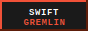
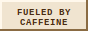

# Hi, I'm Enka 👋

Swift gremlin, occasional developer, and certified "I swear I used to know how to code" survivor.

I mainly work with **Swift** and **SwiftUI** — but at this point I also let Codex cook, because my brain has offloaded half its syntax memory to the cloud 💀

---

### 🧪 What lives here

Most of what shows up in this repo garage will probably be:

- silly little side projects :3
- random experiments made at 2 AM
- Apple ecosystem tinkering
- game-related tools
- things that started as "this should take 10 minutes" and became a whole arc

Currently orbiting somewhere between **Genshin Impact**, **Neverness to Everness**, and whatever niche optimization rabbit hole has kidnapped me this week.

---

### 💻 Languages & Tools

Things I have used, fought with, or vaguely remember how to summon:

  
  
  
  
  
  
  
  
  

---

### 🎮 Current Brainrot

- Neverness to Everness
- Genshin Impact
- game tools, utilities, and questionable automation ideas
- making tiny projects that probably did not need to exist but absolutely do now

---

### 🛠️ Dev Philosophy

> If it works, ship it.
> If it breaks, blame the async state.
> If Codex fixed it, we pretend I was simply *"architecting at a higher level."*

---

### 🌃 Vibe

**NTE city lights + Apple dev tools + caffeine + one more side project I definitely do not have time for.**

Welcome to the repo garage. Some builds are clean. Some are held together by duct tape, hope, and comments I wrote while sleep deprived.

---

### 🔘 Button Wall

  
  
  
  
  
  

Webring rules apply: take one if you vibe with it.
